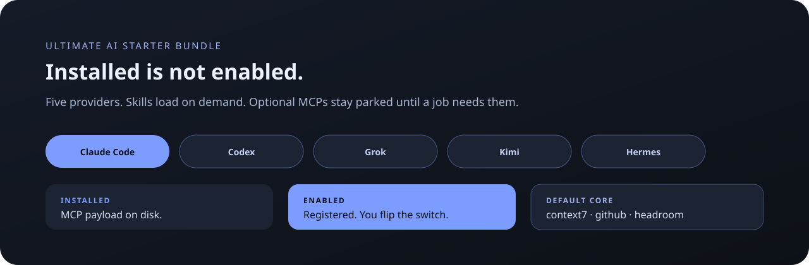

<!-- Ultimate AI Starter Bundle v8.7.37 -->
<p align="center">
  
</p>

<div align="center">

# Ultimate AI Starter Bundle v8.7.37

**Multi-provider AI starter kit. Not a Skyrim-only pack.**

Skills, MCP servers, plugins, and offline tools for Claude Code, Codex, Grok,
Kimi, and Hermes — plus an optional deep Skyrim SE/AE modding stack.

<p>
  <a href="https://github.com/SenjuWoo/Ultimate-AI-Starter-Bundle/actions/workflows/ci.yml"></a>
  <a href="LICENSE"></a>
  <a href="VERSION.txt"></a>
  <a href="https://github.com/SenjuWoo/Ultimate-AI-Starter-Bundle/releases/latest"></a>
</p>

<p>
  <a href="#quick-start">Quick start</a>
  ·
  <a href="#-new-to-ai-cli-tools-read-this-first-installed--enabled">installed ≠ enabled</a>
  ·
  <a href="#what-gets-installed">What gets installed</a>
  ·
  <a href="CHANGELOG.md">Changelog</a>
</p>

</div>

<p align="center">
  
</p>

**Current source:** one-click setup, 172 canonical skills, a small MCP core and
project-specific tools. See [published packages](https://github.com/SenjuWoo/Ultimate-AI-Starter-Bundle/releases/latest),
[the changelog](CHANGELOG.md) and [evaluated component pins](BUNDLED-TOOLS/CATALOG.json).

### Universal Modder without extra background servers

The default installer provides `um` plus the same `universal-modder` skill to all five providers. Its ten upstream guides are on-demand references, not ten additional skill-index entries. Use `um --version`, `um scan "<verified game folder>" --json`, or the relevant subcommand's `--help`. The packaged knowledge base works offline; its examples must be rechecked against your actual game. Existing engine/Skyrim skills remain the implementation specialists.

The bundle does not install the upstream fal MCP or its session hooks. Paid fal generation is optional and needs the user's own setup. Video requires an installed FFmpeg; 3D-to-sprite rendering requires Blender. Core carries vendored source; Full-Offline also carries the wheel. Python/runtime and dependency setup can still need network access when they are not already cached.

### Creating a complete GitHub project

"Make a repo" now routes the existing `coding-discipline` and `one-shot-completion` skills to the [repository completion contract](_CANONICAL-SKILLS/github-fleet-maintenance/references/repository-completion.md). It covers real CI, applicable CodeQL/code scanning, Dependabot alerts/security updates/version updates, secret scanning/push protection, vulnerability reporting, a useful README, and usable release assets. The AI must verify server-side settings separately from files and verify published downloads against its build. Public release approval is reused when already given; otherwise the release is prepared before asking. Explicit empty-repo requests stay empty. This adds no MCP server or skill-index entry.

If Grok reports failed Stop hooks or `global/impeccable` PowerShell errors, run `TOOLS\Install-Completeness-Gate.ps1 -Providers Grok` and restart Grok. It repairs the exact known legacy Impeccable command and Claude-hook inheritance, preserving MCP choices and custom commands. Impeccable remains project-gated: the repair does not start its engine globally or download it.

If Codex reports repeated user hook failures, including **Design deep pass** (Stop) or **Checking UI changes** (PostToolUse), run `TOOLS\Install-Completeness-Gate.ps1 -Providers Codex` and restart Codex. Upgrades back up and retire legacy bundle executable gates and the exact obsolete global Impeccable command pair from native `hooks.json`. Those Impeccable entries target an executable the current skill no longer ships; current opt-in project-local `hook.mjs` handlers stay intact. Custom sibling hooks and trust state are preserved; the doctor fails if the retired handlers return. Historical failure counters are not reset, and already-open chats need to reload their configuration.

### Keeping a reviewed local skill update

The installer normally refreshes bundled skill names. To retain an independently maintained copy, record it in the **local-only** `%LOCALAPPDATA%\Ultimate-AI-Starter-Bundle\skill-overrides.json`: `schema: 1`, then `providers`, provider name, skill name, with `digest` and a nonempty `reason`. Calculate the digest using `Get-UabsTreeDigest -Ordinal` from `TOOLS\UABS-Common.ps1`, after reviewing and backing up the entire skill directory. Do not use an ordinary single-file SHA in its place. The installer and doctor verify that whole-tree digest and report it separately as a local override, never as a bundle match. Changed or missing overrides require review; removing an entry rejoins normal bundle-managed sync. Fresh installs have no overrides. Do not publish this registry or private `/learn` reports.

---

## ⚡ NEW TO AI CLI TOOLS? Read this first: installed ≠ enabled

One distinction explains almost everything about how this pack behaves:

| State | What it means | What it costs you |
|---|---|---|
| **INSTALLED** | A CLI/server payload exists on disk | A disconnected server adds no MCP schema; installed skills/plugins have separate discovery and hook behavior. |
| **ENABLED** | Registered in a provider's config | Available in that scope after trust/connection checks; schema loading and billing depend on the provider. |

The 172 **skills** use a compact discovery index and load their bodies on demand. MCPs can also support deferred discovery or native filters. houseCARL's historical ~41,768 figure estimates its full schema at bytes/4; it is not a measured charge per turn. Profiles keep optional capabilities relevant and the default surface small.

### What's ON after install

The bundle's default core is `context7` (library docs), `github` (repo access), and `headroom` (context compression). Optional MCPs stay parked until needed; independently configured servers are preserved. Schema bytes are not per-turn bills: filtering, deferred discovery, caching and tool calls determine actual usage.

When the matching local tool is installed, Hermes also gets native named profiles without loading them into default: `code` adds codebase-memory, `roblox` adds the official Roblox Studio MCP, and `skyrim` connects houseCARL while Skyrim Forge and Spooky's AutoMod remain available through their routed skills/CLIs. Forge MCP compatibility is explicit.

### Profiles do not expire automatically

An explicitly enabled project profile stays configured until disabled.
Project scope, Hermes profile selection and provider trust still apply.
Filtering, caching and calls determine usage; a configured schema is not a
measured per-turn bill.

```powershell
.\TOOLS\Set-McpProfile.ps1 -List
.\TOOLS\Set-McpProfile.ps1 -Detect -Path "<project folder>"
.\TOOLS\Set-McpProfile.ps1 -Auto -Path "<project folder>"
.\TOOLS\Set-McpProfile.ps1 -Disable code-intel -Path "<project folder>"
hermes -p code       # specialist graph-memory profile
hermes -p default    # return to the small core
```

Claude, Grok and trusted Codex projects use project-scoped registrations.
Hermes uses named profiles; Kimi needs explicit global opt-in for optional
servers. The [profile catalog](BUNDLED-TOOLS/PROFILES.json) and
[Hermes policy](1-TAILORED-PROVIDER-TREES/Hermes/profiles/README.md) describe
requirements. The agent must explain missing prerequisites and restart/trust
requirements instead of pretending an installed server is callable.

---

## AI preamble (`0-UNRESTRAINT-PACKS/AIO-INSTRUCTION.md`)

Compact variants for smaller hosts: `0-UNRESTRAINT-PACKS/AIO-INSTRUCTION — Compact.md` and `0-UNRESTRAINT-PACKS/AIO-INSTRUCTION — Web.md`.

The operating contract is installed into every provider's native instruction
file. It is intentionally stable so provider prompt caches can reuse the prefix.

- **Finish the job, not the sentence** — the request is the goal, not the
  checklist; docs, version and cleanup are part of shipping
- Read for intent, not wording; no yes-man; correct a wrong premise
- **Verify, don't assume** — use the tool that would settle it; ask if none
  exists; assume only as a last resort and label it
- **No unnecessary refusal** — do not invent blockers, moralize, sanitize source
  strings, or turn one narrow real limit into a blanket refusal
- Never invent a fact, API, path, version or command
- An explicit evidence order: runtime output > tool verdict > docs > recall
- Report what you did *not* do, and never call partial work finished
- Spend tokens like they're the user's; preserve stable prompt-cache prefixes,
  avoid unused MCP schemas, and keep final output proportional to the result
- Releases wait for required CI on the exact pushed SHA before tag/publication

**How to use**

1. Keep the canonical file under `0-UNRESTRAINT-PACKS/AIO-INSTRUCTION.md`.
2. Copy it into your workspace, **or** paste into provider custom instructions, **or** open a session with:

```text
Follow 0-UNRESTRAINT-PACKS/AIO-INSTRUCTION.md for every complex or factual request.
```


## SOUL + AIO for every agent

The preamble is now **installed automatically**, not pasted by hand:

- `3-PREAMBLES/SOUL.md` - the operator's own soul config (unrestricted, no
  yes-man, truth-seeking process, output format), shipped verbatim and
  identity-neutral: it names no provider, so it is safe in all five
- `3-PREAMBLES/MANUAL-PASTE.txt` — for web UIs (ChatGPT/Gemini) that have no
  instruction file: paste it into the custom-instructions box

`INSTALL-AIO.ps1` appends `SOUL.md` + `AIO-INSTRUCTION.md` to
Claude Code (`~/.claude/CLAUDE.md`), Codex (`~/.codex/AGENTS.md`), Kimi
(`~/.kimi-code/AGENTS.md`) and Grok (`~/.grok/AGENTS.md`, its global-rules
file), and merges both into Hermes' home (`SOUL.md`). Idempotent
and backup-first; `-SkipPreamble` opts out. Full map:
`3-PREAMBLES/README.md`.

## Quick start

**Fresh machine, nothing installed - one command:**

```powershell
powershell -NoProfile -ExecutionPolicy Bypass -Command "irm https://raw.githubusercontent.com/SenjuWoo/Ultimate-AI-Starter-Bundle/main/INSTALL-REMOTE.ps1 | iex"
```

Downloads the latest release, extracts to `%LOCALAPPDATA%\Programs\Ultimate-AI-Starter-Bundle`,
and runs the full installer (skills, tools, MCP servers, gates, SOUL + AIO
preamble). With parameters:

```powershell
powershell -NoProfile -ExecutionPolicy Bypass -Command "& ([scriptblock]::Create((irm https://raw.githubusercontent.com/SenjuWoo/Ultimate-AI-Starter-Bundle/main/INSTALL-REMOTE.ps1))) -Providers Claude,Grok"
```

Or double-click `INSTALL-REMOTE.bat`. Re-running reuses the matching release
folder and runs the installer again; newer releases refresh that folder.
`-Force` refreshes the same release.

**Windows (bundle already on disk)**

1. Double-click **`START-HERE.bat`**. That is the whole install. Or run:

```powershell
powershell -NoProfile -ExecutionPolicy Bypass -File .\INSTALL-AIO.ps1
```

2. Fully restart your AI app(s).

### Common options

```powershell
.\INSTALL-AIO.ps1 -Providers Grok,Claude
.\INSTALL-AIO.ps1 -Mode OnlineLatest
.\INSTALL-AIO.ps1                 # full install (default)
.\INSTALL-AIO.ps1 -CoreOnly       # smaller core only
.\INSTALL-AIO.ps1 -SkillsOnly
.\INSTALL-AIO.ps1 -ToolsOnly
.\INSTALL-AIO.ps1 -WorkspaceRoot "D:\My\AI-Workspace"
.\INSTALL-AIO.ps1 -WithRtk        # compatibility alias; rtk is already in the default install
.\INSTALL-AIO.ps1 -WithClaudeMem  # + claude-mem (pulls in Bun, runs a daemon)
```

| Mode | Behavior |
|------|----------|
| `OnlineLatest` (default) | Resolve online payloads while respecting evaluated catalog pins and compatibility holds |
| `BundledFirst` | Use `BUNDLED-TOOLS\offline`, fall back to GitHub |
| `BundledOnly` | Require locally bundled payloads; missing payloads cannot be downloaded |

Modes choose tool payloads, not a disconnected Windows environment. Missing
runtimes, Python/npm dependencies and provider bootstrap can still need network.

RTK is deliberately pinned to **0.51.0** in both the installer and component
updater: the narrow rewrite hook and measurements are version-specific. A
new upstream release is not automatically treated as tested. RTK fallback
archives must match the shipped SHA-256 manifest; a rejected replacement
leaves the previous executable intact. Successful replacements retain a
`rtk.exe.bak-uabs-*` backup beside the executable. If an older installation
reports a pin mismatch, rerun `START-HERE.bat` from the current release to
repair it and finish the interrupted install.

### Two installation entry points

| File | Use it when |
|---|---|
| **`START-HERE.bat`** | You already have this folder. Double-click it. This is the install. |
| `INSTALL-REMOTE.bat` | You have nothing yet. It downloads the latest release, then runs `START-HERE.bat` for you. |

Optional gateway/tool launchers have separate jobs; they are not additional
bundle installation steps.

### It wires the providers you have

A plain run detects which provider CLIs are actually installed and configures
those. Through v8.0.4 it assumed all five and then **downloaded the missing
ones**, so a machine with only Claude Code finished a "one-click install"
carrying Codex, Grok, Kimi and Hermes.

```powershell
.\INSTALL-AIO.ps1                        # detect and wire what is installed
.\INSTALL-AIO.ps1 -AllProviders          # fresh machine: install all five
.\INSTALL-AIO.ps1 -Providers Claude,Grok # exactly these
```

Detection is executable presence, not a config folder: uninstalling Kimi
actually removes it from future runs, and a leftover `~/.kimi-code` no longer
counts as an install. A genuinely empty machine detects nothing and falls back
to installing all five, because that is the only outcome that leaves it usable.

**The rule this follows:** bundle defaults optimize for a new user's
reliability; the per-machine result optimizes for the capabilities actually
present on that machine.

### Tools follow the task, not a memorized profile name

The shared `capability-profiles` recipes pair skills, CLIs and narrowly scoped
MCPs for games/modding, UI, assets, code, research and publication. Agents inspect
the actual project and perform supported setup; they do not connect every engine.
Compose only the phases needed. Universal Modder is CLI/skills, not a free local
MCP; Unreal uses discovered editor/CLI tooling, with no audited MCP shipped.

```powershell
.\TOOLS\Set-McpProfile.ps1 -ListTasks
.\TOOLS\Set-McpProfile.ps1 -Task game-unity,assets-3d,publication -Path '<project>' -Plan
```

`-Plan` is read-only. Activation preserves personal entries and existing tool
policies. Hermes has narrow `blender`, `unity`, `godot` and `web` native profiles
when prerequisites exist; `creative` remains available for joint engine work.
An existing chat may require reload/restart; unavailable live tools have CLI
fallbacks. Windows desktop remains opt-in. See [task routing](docs/TASK-ROUTING.md)
for execution, ownership and runtime boundaries. No one-shot quality guarantee.

### Hermes: trim a server to the tools you use

Hermes filters MCP servers at the individual-tool level — `tools.include` /
`tools.exclude`, enforced at registration, so a filtered tool's schema never
reaches the model. Codex also supports `enabled_tools` / `disabled_tools`.
Claude Code supports deferred Tool Search. These are distinct from prompt caching.

houseCARL 1.9.0, historical schema estimates (bytes/4, not billed tokens):

```
Full      45 tools  ~41,768 schema tokens
Lean      42 tools  ~31,369   -25%   ← what the skyrim profile installs
ReadOnly  27 tools  ~17,604   -58%   ← reads, diagnoses, Nexus; nothing writes
```

```powershell
.\TOOLS\Migrate-HermesProfiles.ps1 -SkyrimToolset ReadOnly -Apply
hermes -p skyrim mcp configure housecarl    # or pick tools by hand
```

A filter you set by hand survives re-installs. `TOOLS\Test-Installed-State.ps1`
reports the recorded schema estimate and refuses to price an unmeasured
selection. Loaded, cached and billed tokens remain unmeasured by that check.

### Codex: tools follow the trusted project

`TOOLS\Set-McpProfile.ps1 -Auto -Path <project> -Providers Codex` writes matching
servers to `<project>\.codex\config.toml`. Codex loads this only after you trust
the project; the installer never grants trust. Restart and run
`codex mcp list --json` from the folder to verify effective configuration.
Custom filters and approval settings survive refresh; such entries are reported
and left unchanged rather than having their transport rewritten automatically.

The native Codex 0.152.0 test checks trusted/untrusted scope, unrelated-folder
isolation, actual filtered registration and a harmless tool call without model
inference. See [the verification notes](docs/history/V8.7.17-CHANGELOG.md).
[Codex MCP documentation](https://learn.chatgpt.com/docs/extend/mcp?surface=cli)
and [Claude Tool Search](https://code.claude.com/docs/en/mcp#scale-with-mcp-tool-search)
document the native capabilities; a third-party routing daemon is not required.

### Hermes: models, subscriptions and free/local options

Hermes is a harness, not a model or a BYOK-only service. Its current provider
picker supports API billing, subscription/OAuth routes and local endpoints.
Run `hermes model` outside a chat to configure a provider; `/model` switches
within an existing chat. Use `hermes model --refresh` when its cached catalog
looks stale. [Official provider guide](https://hermes-agent.nousresearch.com/docs/integrations/providers).

The portable starter uses `deepseek/deepseek-v4.1-flash` through OpenRouter.
This is a shipped default, not a claim that it is the newest or best model.
Existing main-model choices are preserved. See [the dated live-catalog review](docs/HERMES-MODELS.md)
for current candidates, legacy aliases, free fallbacks and local options.

Choose by the actual job: tool support, image input when required, sufficient
context, then measured correctness, latency and total cost. Escalate after a
reproducible failure; neither price nor a newer name is a quality benchmark.

Shipped aliases: `v4.1-flash`, `flash`, `flash-vision`, `muse`, `v4-pro`,
`gemini-flash`, `glm`, `grok`, `sol`, `opus`, `nemotron-ultra` and
`nemotron-ultra-nofree`. These retain their configured targets; `sol` and
`opus` do not automatically select the newest generation.

```powershell
hermes model v4.1-flash
hermes model muse
hermes model --refresh
.\TOOLS\Migrate-HermesProfiles.ps1         # inspect proposed changes
.\TOOLS\Migrate-HermesProfiles.ps1 -Apply  # backup + owned migration, Hermes closed
```

The shipped fallback chain is:

```text
poolside/laguna-s-2.1:free -> thinkingmachines/inkling:free
  -> thinkingmachines/inkling-small:free -> poolside/laguna-xs-2.1:free
```

Free endpoints are quota-limited and can disappear. Laguna is text-only:
this chain is not an image-preserving guarantee. Custom chains and aliases
remain user-owned; migration fills missing entries or replaces exact
superseded bundle defaults, not arbitrary model choices.

The retired `inclusionai/ling-3.0-flash-vl:free` compression endpoint is replaced
with `thinkingmachines/inkling:free`, using supported `max` reasoning instead
of `ultra`. Its listed 1,048,576-token context covers the 160,000-token cap.
This is metadata compatibility, not a live summary-quality benchmark; failed
summaries still abort without replacing context. [Profile policy](1-TAILORED-PROVIDER-TREES/Hermes/profiles/README.md).

### Hermes: native web search and keyless options

`web_search` / `web_extract` are Hermes tools, separate from the model provider's
web-search plugin. A local model can drive them, but search/extraction still
contacts the selected external backend; model tokens and paid backends can bill.

The bundle's historical keyless-ring measurements and quotas are recorded in
the [Hermes notes](1-TAILORED-PROVIDER-TREES/Hermes/README.txt); they are not a
current service guarantee. Backend availability depends on installed Hermes,
configuration and upstream quotas. Do not add a duplicate always-on web MCP
merely because a native search call failed.

For a backstop that depends on no vendor account at all, add DuckDuckGo:

```powershell
& "$env:LOCALAPPDATA\hermes\hermes-agent\venv\Scripts\python.exe" -m pip install ddgs
```

Hermes ships the backend already; the package is the only missing piece. Pin it
with `web.search_backend: ddgs` **only** if the free ring gets flaky -- pinning
turns the rotation off.

### Hermes: run a local model, free and off the record

`lmstudio` is a first-class Hermes provider. Point an alias at a model LM Studio
is serving and switch to it with `hermes model local`:

```yaml
model_aliases:
  local:
    model: <the id LM Studio reports at /v1/models>
    provider: lmstudio
    base_url: http://127.0.0.1:1234/v1
```

No API key: Hermes supplies its own placeholder, because there is nothing to
authenticate to. Never write a real secret into an `lmstudio` block.

**Use 65,536 for the bundle's tested LM Studio setup**, then verify the saved
model-load settings and the context actually loaded. Hermes' normal local
floor is 64,000; a one-off load flag does not prove the saved default.
Weights, KV cache and desktop VRAM must fit: use [the budget/settings tools](BUNDLED-TOOLS/lm-studio/README.md)
instead of assuming a 16 GB card can run any model at that context.

Local inference stays on the selected server. Hosted auxiliary models, web
backends or fallbacks can still send data elsewhere; a local main model alone
does not make the entire harness local-only. [Local-model operations](_CANONICAL-SKILLS/local-model-ops/SKILL.md)
covers dynamic model IDs, load verification and performance diagnosis.

**Feeding a chat front-end from the same server?** SillyTavern is happy at 32K,
so 65,536 keeps one loaded model serving both. Two of its behaviours look like
a dead connection and are not: it demands a non-empty API key that a local
server ignores entirely, and a reasoning model returns an **empty** message
when Response Length is small, because thinking tokens come out of the same
budget (measured: 40 tokens in, empty reply; 600 in, 191 of 203 spent
reasoning). It also has no free web-search backend out of the box. All three
are covered in `local-model-ops/references/sillytavern.md`.

### Optional SillyTavern through Hermes

Run `TOOLS\Install-SillyTavernGateway.ps1` to install or repair the lean
`sillytavern` profile and gateway launchers. It works from the bundle root or
from `TOOLS`. Existing `config.yaml` tuning is preserved; `-Force` resets it
from the template with a backup. **No trailing dot after `-Force`.** Changed
launcher/profile text files are backed up beside the originals.

Start LM Studio's developer server on `127.0.0.1:1234` (`lms server start`),
load exactly one chat model at the profile's configured context (65,536 by
default), then run `START-HERMES-GATEWAY.bat` from your Hermes home. The launcher
checks actual loaded chat models, not merely downloaded models or embeddings.
Repeated starts with the same model preserve the config. Keep LM Studio running
while chatting: Hermes still needs its inference server.

SillyTavern's Custom/OpenAI-compatible endpoint is `http://127.0.0.1:8642/v1`.
Use your existing Hermes API server model name and authentication; unlike direct
LM Studio, this gateway requires its configured key. `gateway-starts.log` is
only a start-time ledger; errors are in `profiles\sillytavern\logs`.
No MCP servers or coding plugins are enabled by this profile. Its optional
OpenRouter fallback, vision and compression settings are not local-only.

### rtk: cut command output before it reaches the model

Installed by default with a **bundle-owned narrow hook**; RTK's broad upstream
hook remains disabled. [RTK](https://github.com/rtk-ai/rtk) (Apache-2.0, single
Rust binary) filters noisy dev commands. Measured here
**at rtk 0.51.0** against **pinned tag ranges**, so the corpus cannot drift:

| Command | Raw | Through rtk | Saved |
|---|---|---|---|
| `git log v8.6.1..v8.6.5` | 14,250 B | 1,660 B | **88%** |
| `git diff v8.6.1..v8.6.5` | 430,285 B | 55,870 B | **87%** |
| `git diff v8.6.4..v8.6.5` | 33,453 B | 26,820 B | **20%** |
| `git log --stat -20 v8.6.5` | 102,301 B | 102,301 B | **0%** |

**0% to 88%, depending entirely on the command.** A single headline number for
this tool is not honest -- an earlier version of this table quoted 97% from
`git diff HEAD~3`, which moves with every commit and measures 82.5% today.

**Pin the tool version too, not just the corpus.** That last row used to read
**95%**, measured at rtk 0.45.0. Upgrading to 0.46.0 dropped it to zero, and
0.51.0 still passes `--stat` straight through. All four rows were remeasured
on 2026-10-02; these are output bytes, not billed token savings. The old `git log --stat -20`
row also moved with HEAD despite the rest of the table being pinned; it now
ends at `v8.6.5`. Pinning only the corpus or only the tool is insufficient.

It is a CLI, so it costs **zero standing tokens** -- the same reason this pack
prefers Forge's CLI over Forge's MCP.

#### Off git, it is a different tool

Every number above is a git command, and so was every number this pack had ever
shipped for rtk. Its own pitch is loudest about build output, test runners and
logs, so those were measured too -- same repo, **stdout only**, at 0.46.0:

| Command | Raw | Through rtk | Saved | Fidelity |
|---|---|---|---|---|
| `rtk err <powershell pack gate>` | 5,746 B | 567 B | **90%** | subset |
| `rtk test <python suite, RED>` | 5,507 B | ~400 B | **93%** | failure kept |
| `rtk ls -la` | 811 B | 271 B | **67%** | rewritten |
| `rtk ls -R` (164-skill tree) | 25,059 B | 19,129 B | **24%** | rewritten |
| `rtk grep -rn` | 17,588 B | 14,463 B | **18%** | **truncates** |
| `rtk wc -l` | 5,414 B | 5,003 B | **8%** | rewritten |
| `rtk read` (191 KB `.py`) | 191,795 B | 191,795 B | **0%** | byte-identical |
| `rtk json` (5,425-row array) | 1,121,123 B | 144 B | *100%* | **truncates** |

**Excluding the rows that truncate rather than compress, the non-git aggregate
is 7.4% -- against 85.2% on git.** rtk is a git tool that also ships filters.

Two traps in that table. `rtk json` returning 144 bytes from 1.1 MB is not
compression: it prints **one** array element and `... +5424 more`. And **stdout
only** matters -- rtk writes a 78-byte `No hook installed` nag to *stderr* on
every invocation, which inverts the ratio on small outputs. A 4,869-byte result
measured **-486%** until stderr was excluded.

**`rtk find` breaks on compound predicates, and upstream knows.** A simple
`rtk find TOOLS -name '*.ps1'` is fine -- 709 B to 565 B, 24 files, exit 0. Add
a compound predicate and it collapses:

```
$ rtk find . -name '*.ps1' -not -path './.git/*'     # stdout: 0 bytes, exit 1
/usr/bin/find: paths must precede expression: `INSTALL-REMOTE.ps1'
```

The August 2026 review recorded **ten-plus issues against `rtk find` alone** in
`rtk-ai/rtk`,
including four near-duplicate reports of exactly this (#2469, #2847, #3256,
#3458), silent omission of gitignored (#3656) and hidden (#3291) files, and
**#3410** -- the rewrite rule for `find` is *unconditional*, so
`find ... -delete` / `-exec` is captured and refused, **silently doing nothing
and breaking `&&` chains**. That last one is upstream's report, not measured
here.

`rtk find` also **reformats paths**: single-directory mode drops the directory
prefix (`Build-Release.ps1`, not `TOOLS/Build-Release.ps1`), and across
directories it regroups under a `10F 2D:` header. The saving is real and small;
the output is not a path list you can pipe.

**Correction: rtk does not always discard.** Earlier releases of this README and
the catalog said flatly that rtk keeps no archive. That holds for `rtk git`,
`rtk ls`, `rtk read`, `rtk json` and `rtk wc` -- verified, no tee file is
written. It is **false** for `rtk test`, which writes a *complete* tee log (all
96 result lines) to `%LOCALAPPDATA%\rtk\tee` and prints the path, and only
partly true of `rtk grep`, which tees 6,482 of 17,588 bytes in per-file chunks
**and prints the retrieval command inline** -- it cuts each file at 25 hits and
appends `+28 more in <file> [see remaining: tail -n +26 "<tee path>"]`, so that
truncation is recoverable rather than lost.

**Know what the filters drop**, because `-g` applies them to commands you did
not opt into. `rtk ls -la` removes **timestamps and owner** and rounds sizes
(`36.6K` for 37,481 B) -- it cannot answer when a file changed or how big it
exactly is, the two usual reasons to pass `-la`. `rtk grep` abbreviates middle
path segments to `TOOLS/.../hooks/assumption_gate.py`. `rtk find` strips or
regroups directory prefixes. In each case the saving is real and the output has
stopped being a value you can pipe.

#### Default safe routing

No flag is needed. A normal install adds the binary and the bundle's allowlist
hook. `-WithRtk` remains a harmless compatibility alias for old scripts. The
safe hook rewrites only commands whose shape and output were measured:

| You type | Bundle runs | Policy |
|---|---|---|
| `git status`, `git status --short`, `git status -s` | `rtk git status ...` | automatic; a staged/unstaged/deleted/renamed/Unicode/untracked fixture was line-identical 5/5 |
| standalone `pytest`, `cargo test`, `go test` | RTK's matching test filter | automatic only for human-facing terminal output |
| `git diff`, `git show`, `git log` | unchanged | raw; the large measured diff retained only 361 of 5,856 changed lines |
| `git add`, `git commit`, `git push` | unchanged | mutating Git is never wrapped |
| `find`, `rg`/`grep`, `cat`, `curl`, `gh` | unchanged | broken, lossy, zero-gain, or exact-body surfaces stay raw |
| JSON/JUnit/report output, pipes, redirects, compound commands | unchanged | machine-readable and composable output stays raw |
| `npm test`, `dotnet test`, `python x.py` | *not rewritten* | Outside the bundle's tested allowlist |

Claude, Grok and Hermes receive the executable hook. Codex and Kimi receive the
same narrow routing rule in their installed instructions. Codex supports native
hooks, but this bundle does not bypass trust or install its executable gates
there; stale bundle-owned native handlers are retired on upgrades. Unknown payloads, missing RTK, RTK
errors, unsupported commands, and an RTK version newer than the measured catalog
pin all fail open to the original command.

You can still invoke other filters deliberately:

```powershell
rtk git status
rtk err <command>
rtk test <test command>
```

Why not use RTK's broad hook or Hermes' `rtk-rewrite` plugin? The current rewrite
table catches lossy diff/log/show, broken compound `find`, `cat` at 0% gain,
truncating search, exact `curl`/`gh` output, and even `git add`/`commit`/`push`.
This pack recommends neither broad path. The bundle hook delegates to RTK only
after its own allowlist passes, so `exclude_commands` is not the safety boundary.
Telemetry is opt-in and stays off. `rtk gain` verifies recorded invocations; an
agent's self-report does not prove that a rewrite actually ran.

### claude-mem is opt-in

Ordinary default components use the automated installer; optional editor/cloud
integrations still need their prerequisites. claude-mem pulls in the Bun runtime,
runs a background worker daemon, and needs a Claude Code restart before its
tools appear -- three surprises for one double-click, so it moved behind a flag:

```powershell
.\INSTALL-AIO.ps1 -WithClaudeMem
```

## What gets installed

- **Provider skills** — 172 skills per AI (Claude, Codex, Grok, Kimi, Hermes), all generated from one canonical tree.
- **Native plugins** — Superpowers and Ponytail use each provider's official/native plugin lifecycle; Claude-only `claude-mem` installs Bun automatically when needed.
- **MCP servers** — context7, official GitHub, and Headroom are the verified always-on core. Hermes isolates codebase-memory in `code`, the official Studio MCP in `roblox`, and houseCARL in `skyrim`; the remaining browser/editor/game profiles stay off outside matching projects, and credentialed servers stay off until their key exists.
- **houseCARL** MCP + MO2 instance or Vortex shim setup
- **Spooky's AutoMod Toolkit**
- **codebase-memory-mcp** — installed but enabled only by Claude/Grok/trusted Codex project-scoped `code-intel` or Hermes' native `code` profile; `.cbmignore` + `TOOLS/Setup-CodebaseMemory-Index.ps1` keep the graph on source, not asset trees
- **Headroom** (context compression, registered as an MCP server — see [Headroom + Grok](#headroom--grok))
- **Superpowers** + **Ponytail** plugins/skills
- **CodeBurn** CLI (installed by default, invoked when needed)
- **RTK** CLI and narrow safe routing; not a blanket command rewriter
- **Universal Modder** CLI, offline knowledge and one on-demand guide router
- **Impeccable** — UI design router plus a pinned executable HTML/CSS detector; no second browser download
- **img2threejs** — staged image-to-procedural-Three.js reconstruction with resumable evidence gates
- **Safe skill discovery** — telemetry-free pinned catalog search; candidates still pass provenance and dedupe review before fanout
- Grok MCP wiring + portable tool discovery

### Skyrim Forge

**Skyrim Forge 6.0.0 is developed in this repository**, at `BUNDLED-TOOLS/skyrim-forge`. It is source, not a downloaded payload, so both release variants carry it in full and there is no separately released archive that can drift out of step with the installer that reads it -- which is exactly how v7.8.0 shipped an installer calling a contract field Forge never emitted. The AIO installs or repairs it into ONE versionless install root, migrating any version-stamped install onto it and preserving `Workspaces` and the virtualenv, refreshes the five provider skills/descriptors, sets `SKYRIM_FORGE_ROOT`, and proves the result runs with `forge doctor` before the final success banner. Its 52-tool MCP is no longer global: `game-skyrim` activates it only for matching Claude/Grok/trusted Codex projects; Kimi/Hermes use the same installed CLI through the skill. Choose where it lands with `-ForgeRoot`; the default is `%LOCALAPPDATA%\Skyrim-Tools\Skyrim-Forge`.

## Update tools later

```powershell
.\TOOLS\Update-From-GitHub.ps1
.\TOOLS\Update-From-GitHub.ps1 -Components housecarl,codebase-memory -UpdateCatalogOffline
.\TOOLS\Ensure-Tools.ps1
.\TOOLS\Setup-HouseCarl.ps1
```

## Layout

```text
1-TAILORED-PROVIDER-TREES/   per-AI tailored skill trees
BUNDLED-TOOLS/offline/             shipped tool zips/wheels
BUNDLED-TOOLS/plugins/             Superpowers + Ponytail
BUNDLED-TOOLS/CATALOG.json         component registry
COPY-TO-YOUR-WORKSPACE/            workspace files + _PROJECT-TEMPLATE (incl. .cbmignore)
0-UNRESTRAINT-PACKS/               no-holds prompt library (v6.9.2)
3-PREAMBLES/                      SOUL + AIO preamble for every agent (v7.5.0)
TOOLS/                             installers and discovery scripts
TOOLS/Setup-CodebaseMemory-Index.ps1   index scope generator (v7.0.0+)
_CANONICAL-SKILLS/              maintainer master skills
INSTALL-AIO.ps1                   master installer
START-HERE.bat / INSTALL-REMOTE.bat   local / remote entry points
START-HERE.txt                     short human guide
```

## Docs

- [Quick start](START-HERE.txt) and [AIO guide](AIO-GUIDE.md)
- [Component catalog](BUNDLED-TOOLS/CATALOG.json), [capability profiles](BUNDLED-TOOLS/PROFILES.json) and [tool evaluations](docs/TOOL-EVALUATIONS.md)
- [Hermes model review](docs/HERMES-MODELS.md) and [native profile policy](1-TAILORED-PROVIDER-TREES/Hermes/profiles/README.md)
- [LM Studio settings and VRAM budgeting](BUNDLED-TOOLS/lm-studio/README.md)
- [Skyrim assistant/task selection](WHICH-AI-SHOULD-I-USE-FOR-SKYRIM.md), without unsupported provider rankings
- [Tool notices](BUNDLED-TOOLS/THIRD-PARTY-NOTICES.md) and [skill notices](_CANONICAL-SKILLS/THIRD-PARTY-NOTICES.md)
- [Changelog](CHANGELOG.md), [historical notes](docs/history/) and [latest published package](https://github.com/SenjuWoo/Ultimate-AI-Starter-Bundle/releases/latest)

Historical notes describe their release, not the current installation policy.

## AI contract

Skills teach **portable discovery**. Paths are resolved from env vars, `LOCALAPPDATA`, and `PATH` — never hardcoded drive letters or usernames.

If a tool is missing, the AI should recommend `INSTALL-AIO.ps1`, `Ensure-Tools.ps1`, or `Update-From-GitHub.ps1` — not invent paths or fake MCP results.

## Third-party components

This list includes redistributed code, fetched packages and catalog-only candidates.
**A listing does not mean installed or connected.** Evaluated versions, source
commits and compatibility holds belong in [CATALOG.json](BUNDLED-TOOLS/CATALOG.json).

| Catalog ID | Upstream project | Integration |
|---|---|---|
| `universal-modder` | [Universal Modder](https://github.com/rehan-remade/universal-modder) | Vendored CLI/source and routed guides; default install |
| `housecarl` | [houseCARL](https://github.com/Avick3110/houseCARL) | Offline payload; game/profile scope |
| `spooky` | [Spooky's AutoMod Toolkit](https://github.com/SpookyPirate/spookys-automod-toolkit) | Offline CLI payload |
| `codebase-memory` | [codebase-memory-mcp](https://github.com/DeusData/codebase-memory-mcp) | Offline payload; code profile |
| `headroom` | [Headroom](https://github.com/headroomlabs-ai/headroom) | Wheel/source; core MCP |
| `superpowers` | [Superpowers](https://github.com/obra/superpowers) | Vendored skills and native plugins |
| `ponytail` | [Ponytail](https://github.com/DietrichGebert/ponytail) | Vendored skills and native plugins |
| `codeburn` | [CodeBurn](https://github.com/getagentseal/codeburn) | Default on-demand CLI |
| `impeccable` | [Impeccable](https://github.com/pbakaus/impeccable) | Vendored skill/detector; separately pinned CLI |
| `code-review-skill` | [Code Review Skill](https://github.com/awesome-skills/code-review-skill) | Vendored canonical skill |
| `obsidian-skills` | [Obsidian Skills](https://github.com/kepano/obsidian-skills) | Vendored canonical skills; no duplicate plugin needed |
| `claude-mem` | [claude-mem](https://github.com/thedotmack/claude-mem) | Explicit -WithClaudeMem only |
| `playwright-mcp` | [Playwright MCP](https://github.com/microsoft/playwright-mcp) | Scoped browser MCP |
| `firecrawl-mcp` | [Firecrawl MCP](https://github.com/firecrawl/firecrawl-mcp-server) | Credential-gated MCP |
| `perplexity-mcp` | [Perplexity MCP](https://github.com/perplexityai/modelcontextprotocol) | Credential-gated MCP |
| `context7` | [Context7](https://github.com/upstash/context7) | Core documentation MCP |
| `github-mcp-server` | [GitHub MCP Server](https://github.com/github/github-mcp-server) | Official offline binary; core MCP |
| `serena` | [Serena](https://github.com/oraios/serena) | Code-intel profile; language-server navigation |
| `chrome-devtools-mcp` | [Chrome DevTools MCP](https://github.com/ChromeDevTools/chrome-devtools-mcp) | Scoped browser inspection |
| `shadcn-mcp` | [shadcn MCP](https://github.com/shadcn-ui/ui) | Matching project registry profile |
| `blender-mcp` | [Blender MCP](https://github.com/ahujasid/mcp-for-blender) | Editor profile; Blender/addon prerequisite |
| `godot-mcp` | [Godot MCP](https://github.com/Coding-Solo/godot-mcp) | Editor profile; Godot prerequisite |
| `unity-mcp` | [Unity MCP](https://github.com/IvanMurzak/Unity-MCP) | Project package/generated executable prerequisite |
| `rtk` | [RTK](https://github.com/rtk-ai/rtk) | Default CLI; narrow routing |
| `omni` | [OMNI](https://github.com/fajarhide/omni) | Catalog/evaluation only; not installed |
| `windows-mcp` | [Windows MCP](https://github.com/CursorTouch/Windows-MCP) | Manual opt-in; OFF by default |
| `super-mcp-router` | [Super MCP Router](https://github.com/mindstone/Super-MCP) | Evaluated catalog entry; no default router wiring |
| `playwright-cli` | [Playwright CLI](https://github.com/microsoft/playwright-cli) | Default CLI; browser installation separate |
| `comfy-cli` | [ComfyUI CLI](https://github.com/Comfy-Org/comfy-cli) | Optional user-managed tool; not installed by default |

Additional canonical payloads without separate tool-catalog entries:

| Payload | Upstream | Integration |
|---|---|---|
| `img2threejs` | [img2threejs/img2threejs](https://github.com/img2threejs/img2threejs) | Vendored skill, forge and fixtures |
| `skill-creator`, `build-mcp-server`, `build-mcpb`, `build-mcp-app` | [anthropics/claude-plugins-official](https://github.com/anthropics/claude-plugins-official) | Selected cross-provider skills, not the entire marketplace |
| Hermes native Unity bridge | [CoplayDev/unity-mcp](https://github.com/CoplayDev/unity-mcp) | Existing Coplay editor backend, isolated in `unity`/`creative`; distinct from the IvanMurzak project route |

Skyrim Forge is the bundle author's product, shipped as source under
`BUNDLED-TOOLS/skyrim-forge`, not a missing third-party download.
[Tool notices](BUNDLED-TOOLS/THIRD-PARTY-NOTICES.md) and
[skill notices](_CANONICAL-SKILLS/THIRD-PARTY-NOTICES.md) retain licenses,
credits and adaptation notes. The pack's MIT license does not relicense these
projects. Preserve upstream attribution when redistributing.

## Headroom + Grok

**The installer registers Headroom as an MCP server for Grok. It does not route
Grok inference through Headroom, and neither should you.**

Headroom's Grok proxy forwards to `https://api.x.ai` and authenticates with
`XAI_API_KEY`. A Grok **subscription** login (the normal one) uses
`https://cli-chat-proxy.grok.com` instead, which Headroom cannot forward.
Wrapping such an account breaks Grok:

```text
model catalog: all retries exhausted   ->  model selector shows "unknown"
Unauthorized (401) from http://127.0.0.1:8787/.../v1/chat/completions
```

The native model list can become unavailable. An older bundle applied that
incompatible wrap; the current installer leaves subscription inference native.

### Grok shows an "unknown" model / expected models are missing

```powershell
.\TOOLS\Ensure-Headroom-Grok.ps1 -Repair
```

Then open a **new** PowerShell window and run `grok`. The repair clears the
`GROK_MODELS_BASE_URL` / `GROK_MODEL_GROK_BUILD_BASE_URL` env vars, renames any
`function grok` that calls `headroom wrap grok`, deletes a poisoned
`models_cache.json`, and tells you how to drop the durable deploy.

If a `~/.headroom/deploy/default/manifest.json` lists `grok` or `grok_build` in
`targets`, remove it — that deploy re-applies the breaking env vars on every
health check, so Grok re-breaks at logon:

```powershell
headroom install remove --profile default
```

### Other Ensure-Headroom-Grok modes

| Command | Effect |
|---|---|
| `.\TOOLS\Ensure-Headroom-Grok.ps1` | MCP registration, auth aware (what the installer runs) |
| `... -CheckOnly` | Report state, change nothing |
| `... -Repair` | Undo a v5.0 wrap |
| `... -Wrap` | Opt in to the inference proxy; **refuses without `XAI_API_KEY`** |

MCP mode gives Grok `headroom_compress` / `headroom_retrieve` /
`headroom_stats` — on-demand compression the agent calls deliberately. It is not
automatic traffic compression, and for a subscription account it is the only
mode that works.

## What's new

[CHANGELOG.md](CHANGELOG.md) is the release history. Detailed measurements and
old decisions live in [docs/history/](docs/history/), not a second README changelog.

## Validation and diagnostics

```powershell
python TOOLS\audit_skills.py <skills-dir>
powershell -NoProfile -ExecutionPolicy Bypass -File .\TESTS\Test-Pack.ps1
python TOOLS\install_live_skills.py _CANONICAL-SKILLS --check
```

The pack gate checks skill trees, PowerShell parsing, offline hashes,
profile writers, hook retirement and fresh-home/upgrade fixtures. The
installed-state doctor separately verifies the actual machine:

```powershell
.\TOOLS\Test-Installed-State.ps1 -Providers Claude,Codex,Grok,Hermes
```

Source validation is not a substitute for local runtime proof.

## Known limitations

- Six skills exceed the body-size budget. Their bodies load on demand;
  these warnings do not mean they cost nothing.
- **The knowledge graph cannot read Papyrus.** Use source search and
  `papyrus-reference` for `.psc`. The graph covers supported languages
  and repository structure, not live load-order truth.
- Compatibility holds are deliberate: a newer upstream release is not
  automatically a tested replacement. See the catalog and dated evaluations.
- Free model availability, quotas and prices change; the live provider
  catalog outranks a dated snapshot.
- Full-Offline carries payload snapshots, not every runtime or dependency cache.
  Fresh-home CI fixtures do not certify every clean Windows machine or account.
- Parsing, packaging and protocol handshakes do not prove actual gameplay,
  connected-editor behavior, paid inference quality or GPU performance.

## Version

**v8.7.37** - 2026-10-07. After a push, etiquette queries GitHub security and
quality flags. A failed or missing query is not a clean repository.
**172 canonical skills**, no new always-on MCP.
[Changes](docs/history/V8.7.37-CHANGELOG.md) ·
[Latest published release](https://github.com/SenjuWoo/Ultimate-AI-Starter-Bundle/releases/latest).

## License

Original bundle code and documentation are [MIT-licensed](LICENSE).
Third-party payloads keep their own terms: see the [tool notices](BUNDLED-TOOLS/THIRD-PARTY-NOTICES.md)
and [skill notices](_CANONICAL-SKILLS/THIRD-PARTY-NOTICES.md).
